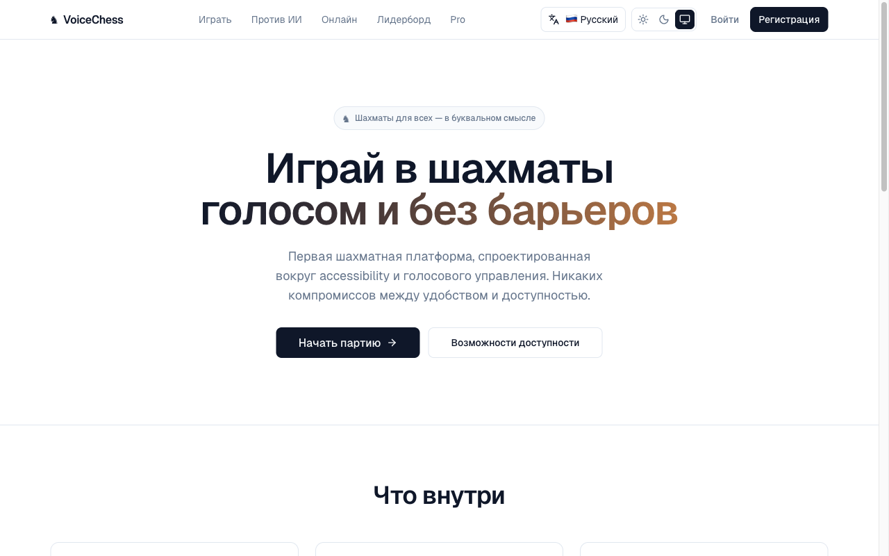
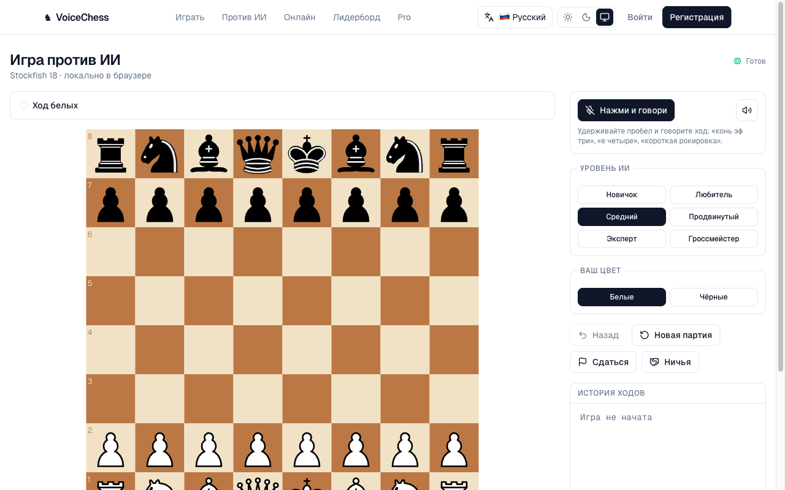
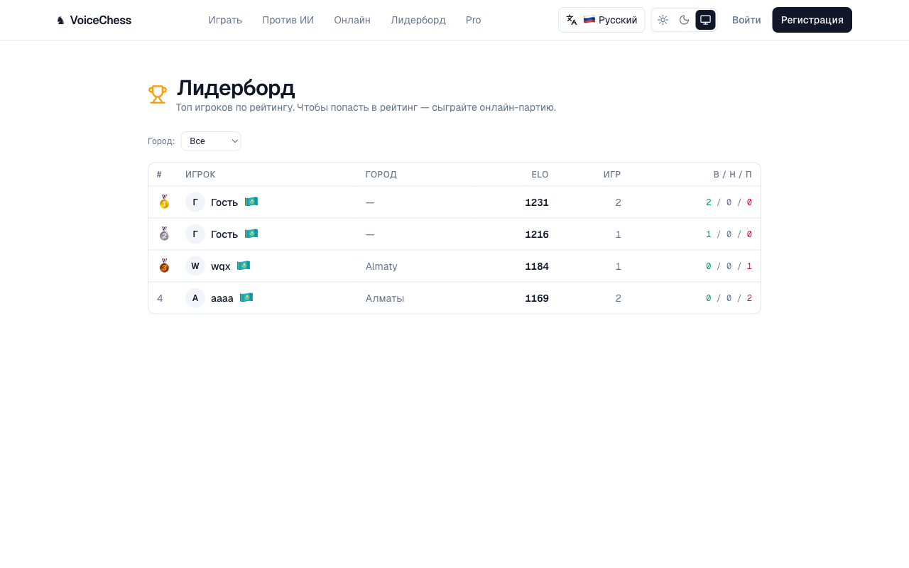
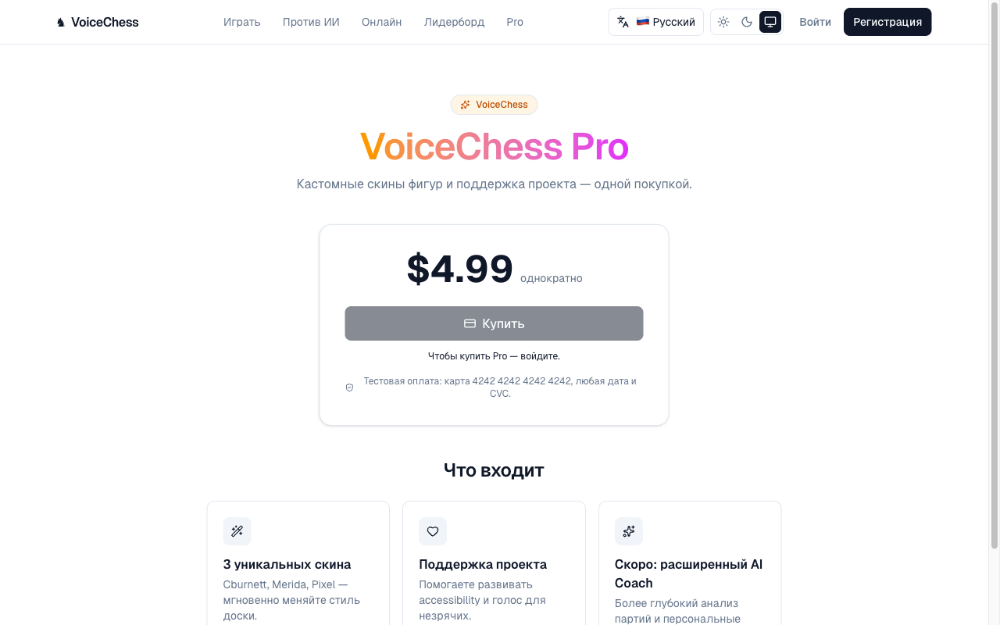
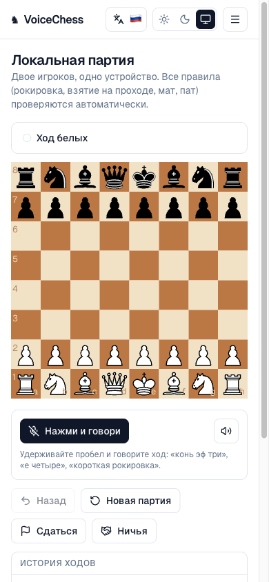

# VoiceChess ♞

**Шахматы голосом и без барьеров.**

🌐 **[Открыть VoiceChess](https://nfactorial-chess-kl3b.vercel.app)**



---

## Что это

**VoiceChess** — это онлайн-платформа, на которой можно играть в шахматы **голосом**: вы говорите ход — и фигура двигается. Без мыши, без касаний, без клавиатуры.

Платформа создана для тех, кто не может или не хочет играть кликами: незрячих, людей с ограниченной моторикой, и просто тех, кому удобнее проговаривать ходы как в живой партии. Поддерживаются три языка распознавания — **русский, английский и казахский**.

Можно играть против сильного компьютерного соперника, с другом по ссылке, или вдвоём за одним устройством. История партий сохраняется, рейтинг растёт, в лидерборде по городам видно с кем соревноваться.

---

## Что внутри

### 🎙️ Голосовое управление
Удерживайте пробел и говорите ход — «конь эф три», «knight to f3», «ат f3-ке». Платформа понимает шахматную нотацию на трёх языках, умеет различать фигуры по контексту и попросит уточнить, если ваш ход неоднозначен.

### 👁️ Полная доступность
Полностью работает с экранными читалками (VoiceOver, NVDA, TalkBack). Все ходы и события озвучиваются. Можно играть только с клавиатуры — без мыши вообще: стрелки, Enter, прыжок к клетке по координатам. Тема высокого контраста и режим без анимаций для пользователей с особенностями восприятия.

### ♟️ Игра против компьютера
Шесть уровней сложности — от Новичка до Гроссмейстера. Сильный шахматный движок работает прямо у вас в браузере, без задержек и без интернета (после первой загрузки).



### 🌐 Мультиплеер по ссылке
Создайте комнату, отправьте ссылку другу — и играйте. Никаких регистраций, установок или приглашений. Видно имя соперника, его рейтинг, флаг страны и место в лидерборде.

### 🏆 Лидерборд
Глобальный рейтинг по системе ELO с фильтрами по странам и городам. Видно ваше место среди игроков из вашего города.



### 📜 История партий
Все ваши партии сохраняются. Можно перейти к любому ходу, разобрать ошибки, скопировать партию в стандартном формате PGN.

### 🌗 Темы и языки
Светлая, тёмная или системная тема. Интерфейс на русском, английском и казахском — переключается одним кликом.

### 💎 VoiceChess Pro
Кастомные скины фигур для тех, кто хочет поддержать проект и сделать доску своей.



---

## Адаптивный дизайн

Удобно играть и с компьютера, и с телефона. Доска занимает весь экран, навигация подстраивается.



---

## Голосовые команды

Можно говорить ходы и команды на любом из поддерживаемых языков:

| Действие | 🇷🇺 Русский | 🇬🇧 English | 🇰🇿 Қазақша |
|---|---|---|---|
| Ход пешкой | «е четыре» | «e4» | «е төрт» |
| Ход фигурой | «конь эф три» | «knight to f3» | «ат f3-ке» |
| Взятие | «слон бьёт це пять» | «bishop takes c5» | «пиль c5-ке алады» |
| Рокировка | «короткая рокировка» | «castle kingside» | «қысқа рокировка» |
| Новая партия | «новая игра» | «new game» | «жаңа ойын» |
| Сдаться | «сдаюсь» | «resign» | «берілемін» |

---

## Горячие клавиши

| Клавиша | Действие |
|---|---|
| `Стрелки` | Перемещение фокуса по доске |
| `Enter` / `Space` на клетке | Выбрать фигуру / сделать ход |
| `Esc` | Снять выделение |
| `a-h`, `1-8` | Прыжок на конкретную клетку |
| `Пробел` (вне клетки) | Push-to-talk — удерживать и говорить |

---

## Технологии

Под капотом, простыми словами:

- **Фреймворк:** Next.js (React) + TypeScript — современный фреймворк для веб-приложений.
- **База данных и авторизация:** Supabase — облачная PostgreSQL и встроенный auth.
- **Шахматный движок:** Stockfish 18 — один из сильнейших в мире, запускается прямо в браузере (WebAssembly).
- **Голос:** браузерный Web Speech API для русского и английского, OpenAI Whisper для казахского.
- **Платежи:** Stripe для покупки Pro-подписки.
- **Деплой:** Vercel.

Стилизация — Tailwind CSS. Стейт — React + Zustand. Тестирование — Vitest.

---

## Запуск локально

Если хотите запустить у себя:

```bash
git clone https://github.com/aliyawqx/nfactorial-chess.git
cd nfactorial-chess
npm install
cp .env.example .env.local   # заполните ключи (см. ниже)
npm run dev
```

Откройте [http://localhost:3000](http://localhost:3000).

### Что должно быть в `.env.local`

```env
# Supabase (обязательно — без него не работает БД и авторизация)
NEXT_PUBLIC_SUPABASE_URL=https://<your-project>.supabase.co
NEXT_PUBLIC_SUPABASE_ANON_KEY=<anon JWT key>
SUPABASE_SERVICE_ROLE_KEY=<service role JWT key>

# Stripe (опционально — нужен только для Pro-покупок)
STRIPE_SECRET_KEY=sk_test_...
NEXT_PUBLIC_STRIPE_PUBLISHABLE_KEY=pk_test_...
STRIPE_WEBHOOK_SECRET=whsec_...

# OpenAI (опционально — для распознавания казахского голоса)
OPENAI_API_KEY=sk-...
```

Где взять:
- **Supabase** — зарегистрируйтесь на [supabase.com](https://supabase.com), создайте проект (бесплатно). Ключи в Project Settings → API. SQL-миграции в папке [`supabase/migrations/`](supabase/migrations) запустите через SQL Editor.
- **Stripe** — зарегистрируйтесь на [stripe.com](https://stripe.com), включите Test mode, ключи в Developers → API keys.
- **OpenAI** — ключи в [platform.openai.com](https://platform.openai.com).

### Запуск тестов

```bash
npm test
```
